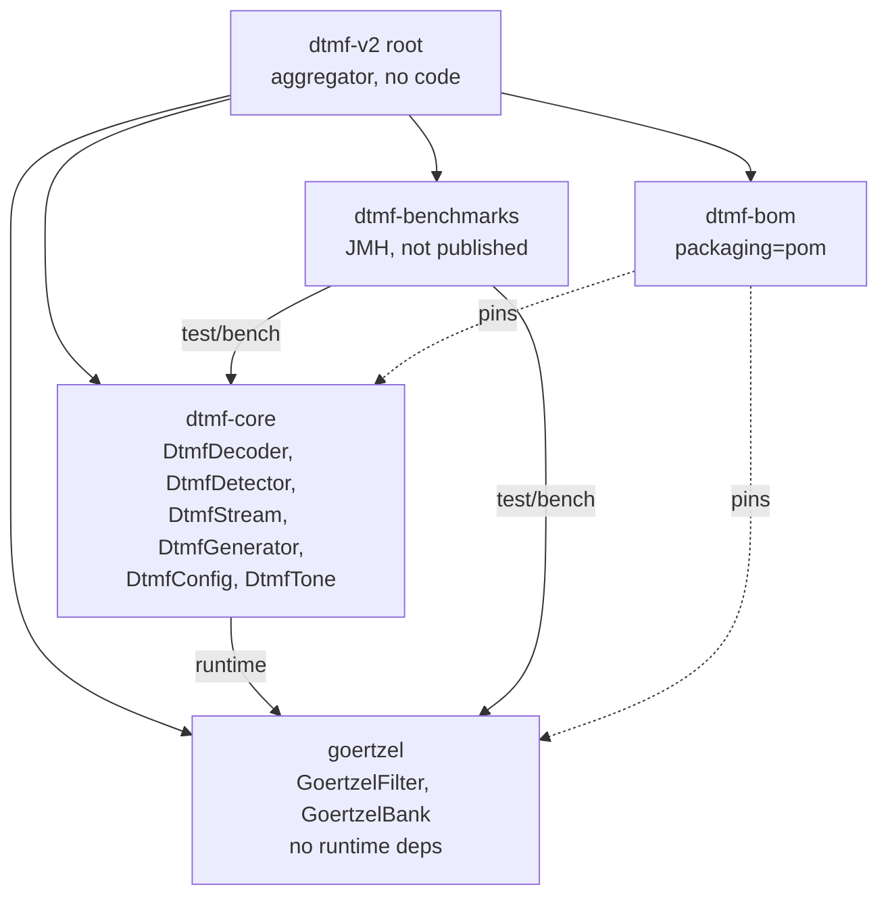

# DTMF-Decoder — Design

This document captures the architectural decisions behind the library. Implementation-level details (constructor signatures, state-machine transitions, formulas) live in the Javadoc on the relevant classes — this document explains **why** those choices were made, not **how** they work in detail.

## Three choices that shaped everything

### 1. Goertzel-only detection backend

The detector is a bank of eight tuned second-order IIR filters, not an FFT. This:

- Removes the `frameSize must be a power of 2` constraint that shaped v1's API
- Lets analysis-block length be picked purely from target bin width (40–60 Hz)
- Keeps per-block cost proportional to `8 × blockSize` rather than `N log N`

A comparative FFT benchmark lives in the `dtmf-benchmarks` module for contrast but is never wired into production paths.

### 2. Analysis-block-centric pipeline shared by batch and push

Both the batch [`DtmfDecoder`](../dtmf-core/src/main/java/com/tino1b2be/dtmf/DtmfDecoder.java) and the push [`DtmfDetector`](../dtmf-core/src/main/java/com/tino1b2be/dtmf/DtmfDetector.java) funnel samples through the **same** internal `AnalysisPipeline`. The batch path is a thin wrapper that calls the streaming detector and collects its emissions.

This is the single most important architectural decision in the library. Chunk invariance (Req 6.7) and pull-vs-push equivalence (Req 7.5) become *structural properties* — they hold by construction, not by a post-hoc test. There is literally one pipeline, so "feeding a buffer in one `process(B)` call" and "feeding the same buffer in chunks" are the same code path.

### 3. Tiered config — four factories plus one advanced builder

`DtmfConfig.defaults() / forTelephony() / forVoip() / forNoisyAudio()` cover 95% of callers. `DtmfConfig.advanced()` exposes window function, twist tolerances, confirmation-frame count, and the broader sample-rate domain `[4000, 192000] Hz`. The common path stays small; the specialist path stays one method call away.

## Module graph



- `goertzel` is a leaf. Zero runtime dependencies outside the JDK. Useful on its own for frequency analysis at arbitrary target frequencies.
- `dtmf-core` depends on `goertzel` and only `goertzel` at runtime. Tone detection, tone generation, streaming iterators, and config all live here.
- `dtmf-benchmarks` is not published. May include an FFT-based benchmark comparator.
- `dtmf-bom` is a `pom`-packaged Maven BOM listing `goertzel` and `dtmf-core` at a coordinated version.

## Analysis-block sizing

Bin width = `sampleRate / blockSize`. The library picks `blockSize` so the effective width lands in `[40, 60]` Hz, targeting 50 Hz. For the four Supported_Sample_Rate values this always lands exactly:

| Sample rate | N | Bin width (Hz) | Block duration (ms) |
|-------------|---|----------------|---------------------|
| 8000        | 160 | 50.00 | 20.00 |
| 16000       | 320 | 50.00 | 20.00 |
| 44100       | 882 | 50.00 | 20.00 |
| 48000       | 960 | 50.00 | 20.00 |

20 ms per block gives a ±20 ms worst-case timing tolerance (Req 12.4), which is tight enough for telephony signalling. The algorithm is a rounded divide plus a clamp; see `BlockSizer.blockSizeFor` for the implementation.

## Detection pipeline — state machine shape

The per-channel pipeline runs an `Idle → Confirming → Active → Ending → Idle` state machine at the analysis-block level. See the Javadoc on [`AnalysisPipeline`](../dtmf-core/src/main/java/com/tino1b2be/dtmf/internal/AnalysisPipeline.java) for the transition table, entry/exit actions, and the jitter-recovery arc that makes `Ending → Active` round-trips work.

Two decisions worth calling out:

- **`toneEnd` is the first sample of the first non-confirming block** (not the last sample of the last confirming block). This keeps block boundaries unambiguous and makes `duration = toneEnd − toneStart` a clean subtraction.
- **Emissions happen on `Ending → Idle`, not on `Active → Ending`**. The intervening `Ending` state is what lets brief noise interruptions be absorbed without dropping the tone.

## Twist and confidence

Twist per ITU-T Q.24:

```
twistDb = 10 × log10(highGroupEnergy / lowGroupEnergy)
```

Zero-low-energy returns `+Infinity` so any finite tolerance rejects — handled in [`TwistEvaluator`](../dtmf-core/src/main/java/com/tino1b2be/dtmf/internal/TwistEvaluator.java).

Confidence is the fraction of in-band energy captured by the two peak bins:

```
confidence = clamp((peakLow + peakHigh) / (ε + sumAllEight), 0.0, 1.0)
```

with `ε = 1e-12` to guard against division by zero on silence. Pure DTMF → ~1.0; white noise → ~0.25 (two of eight equal bins); silence → 0.0. See [`ConfidenceScorer`](../dtmf-core/src/main/java/com/tino1b2be/dtmf/internal/ConfidenceScorer.java).

The detection threshold in `DtmfConfig.detectionThreshold` is compared against this same ratio, so the reporting value and the gating value have one consistent interpretation.

## DTMF frequency table (ITU-T Q.23)

| Low group | 1209 Hz | 1336 Hz | 1477 Hz | 1633 Hz |
|-----------|:-------:|:-------:|:-------:|:-------:|
| **697 Hz**  | 1 | 2 | 3 | A |
| **770 Hz**  | 4 | 5 | 6 | B |
| **852 Hz**  | 7 | 8 | 9 | C |
| **941 Hz**  | * | 0 | # | D |

Represented internally as `FrequencyBins.KEY_MATRIX[lowIndex][highIndex]`. Peak selection collapses to `argmax` over the four low-group bins and `argmax` over the four high-group bins — impossible to wire wrong.

## Property-based test coverage

Every correctness property maps to exactly one jqwik `@Property` method tagged:

```java
// Feature: dtmf-v2-foundation, Property N: <title>
```

with the validated requirement named in the test's Javadoc.

| # | Property | Validates |
|---|----------|-----------|
| 1 | Chunk invariance | Req 6.7, 6.8 |
| 2 | Tone emission invariants | Req 5.2–5.6, 13.2, 13.4 |
| 3 | Generator → decoder round-trip | Req 11.6 |
| 4 | Silence produces no tones | Req 12.2 |
| 5 | Timing accuracy within one analysis block | Req 12.4 |
| 6 | Sample-format normalisation | Req 4.5, 4.6, 4.7 |
| 7 | Callback fires exactly once per tone, at tone-end | Req 6.4, 6.5 |
| 8 | Pull API matches push API | Req 7.5 |
| 9 | GoertzelBank matches reference DFT magnitudes | Req 10.4 |
| 10 | Generator produces the correct frequency pair per key | Req 11.2 |
| 11 | Generator segment durations match config | Req 11.4, 11.5 |
| 12 | Twist tolerance is applied exactly as configured | Req 9.3, 9.4 |
| 13 | Twist formula identity | Req 9.1 |
| 14 | Stereo independent channels produce per-channel emissions | Req 13.3 |
| 15 | Stereo downmix equals mono decode of the average | Req 13.4 |
| 16 | DtmfTone time helpers are consistent with sample indices | Req 14.1–14.3 |
| 17 | Input validation | Req 16.1, 16.2 |
| 18 | No retention or mutation of caller-supplied arrays | Req 16.4 |
| 19 | Analysis-block bin width is in [40, 60] Hz across the advanced domain | Req 3.4, 3.5 |
| 20 | Standard factories reject unsupported rates | Req 3.3 |
| 21 | Minimum tone duration lower bound | Req 8.8 |

Integration-scale statistical tests (99.5% detection rate across 500 tones per sample rate, 60-second silence, 1-minute white-noise false-positive ceiling) live in `dtmf-core/src/integrationTest/java/` and are excluded from the default `test` task — run them via `./gradlew :dtmf-core:integrationTest`.

## Why a block-synchronous detector instead of sample-synchronous?

The state machine advances once per analysis block (once every 20 ms at every Supported_Sample_Rate), not once per sample. That keeps the hot path cheap — eight Goertzel filter updates per sample, one peak-pick and state transition per 160–960 samples. A sample-synchronous detector would have to re-evaluate every bin on every sample, which is ~500× more work at 8 kHz, and doesn't improve accuracy because the bin width is already decoupled from sample rate.

## Why `Consumer<DtmfTone>` instead of an event stream?

`DtmfDetector.onTone(Consumer<DtmfTone>)` is the push API's sole emission channel. Alternatives considered:

- **`Flow.Publisher` / reactive streams** — over-engineered for a synchronous per-block emission. A `Consumer` is honest about the contract: it runs synchronously inside the `process` call.
- **Polling via `drain() → List<DtmfTone>`** — would force callers to buffer emissions and poll, re-introducing the batching problem the push API exists to solve.
- **Multiple listeners** — callers who need fan-out can wrap their own `Consumer` that dispatches to multiple sinks. Forcing a list of listeners into the API would bake a policy decision most callers don't need.

## Why records for `DtmfTone` but a builder for `DtmfConfig`?

`DtmfTone` has six fields, all primitive or small, all required, all together on every construction path. Record syntax gives canonical `equals`/`hashCode` and a useful `toString` for logs, for free.

`DtmfConfig` has ten fields, many with defaults, and callers routinely want to override two or three while inheriting the rest. A builder keeps the common-case construction (`DtmfConfig.forTelephony()`) one method call long while the specialist path (`DtmfConfig.advanced().sampleRate(16000).windowFunction(HAMMING).build()`) stays readable without nine-argument constructor calls.
